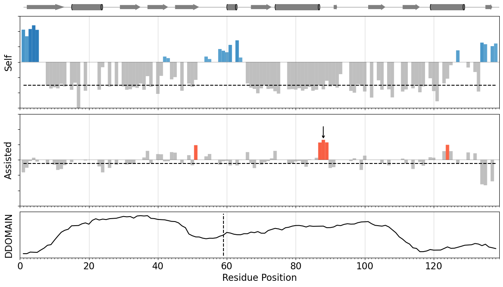

# HiTS-seq

A custom python pipeline for analyzing Illumina MiSeq data for High-Throughput Split Profiling.
 
## Python environment

```bash
conda create -n hits-seq python=3
conda activate hits-seq
conda install scipy, biopython, numpy, matplotlib, regex, xlsxwriter
```

## Sequencing data processing

Repeat for each library (prefix - T,A,R)

```bash
pear-0.9.6-bin-64 --forward-fastq ${PREFIX}_H2TMJCCX2_L1_1.fq.gz --reverse-fastq ${PREFIX}_H2TMJCCX2_L1_2.fq.gz --threads 32 --output ${PREFIX} 2>&1 | tee pear.log

python process_reads.py ${PREFIX}.assembled.fastq data/nucleotides.fasta data/transposon.fasta data/Transposition_counts/${PREFIX}_counts/
```

Note: These may be very long-running processes.

## Statistical analysis

```bash
python run_analysis.py fosA3 data/Transposition_Counts/ data/proteins.fasta data/dssp/fosA3.dssp data/ddomain/fosA3.ddomain \
--boundary 59 --outdir outputs/ --pymol outputs/fosA3.pml data/pdb/5vb0.pdb C
```



## License

This project is licensed under the MIT License - see the [LICENSE](./LICENSE) file for details

## Acknowledgments

* The authors of the [CPP-seq](https://github.com/SilbergLabRice/CPP-seq) and [DESeq](https://genomebiology.biomedcentral.com/articles/10.1186/gb-2010-11-10-r106) packages which formed the basis of the statistical analysis used in this work.

* Joao Rodrigues for the [method](https://gist.github.com/JoaoRodrigues/f9906b343d3acb38e39f2b982b02ecb0) to draw secondary structures in matplotlib
